## MODE OPÉRATOIRE

### Prérequis (Back)
- Java 1,8
- Maven (+ commandes exécuter/déployer)

- SGBDR MySQL
- schema.sql (création de la base et des tables)
- data.sql (obtention des données)

#### Modifications nécessaires (Java : /Fil_Rouge/src/main/resources/application.properties)
- spring.datasource.url=jdbc:mysql :
- spring.datasource.username
- spring.datasource.password

- Si besoin de changer le port du serveur Tomcat,  ajouter la ligne : 
server.port: XXXX

### Prérequis (Front)
- NodeJS

### Lancement

#### Back
Via GitHub :
1. Cloner le repo
2. Ajouter le projet à votre IDE préférée
3. Faire un ```MVN Clean Install```
4. Faire un Maven Update Project
5. Lancer l’application via : Run as Spring Boot App

Via le fichier jar:
/!\ Avec le Jar déjà compilé, aucune modification de la section 2 n’est possible /!\
1. Ouvrir une invite de commande dans le dossier contenant le fichier jar
2. Entrer : java -jar monFichier.jar

#### Front
1. Cloner le repo
2. cd Fil_Rouge_Front/FilRougeFront
3. ```npm install```
4. ```npm install -g @angular/cli```
5. ```ng serve -o```
6. ```ng build``` (créer le dist/ avec l’index html)

## DIAGRAMMES

### USECASE

- USECASE DE L’APPLICATION

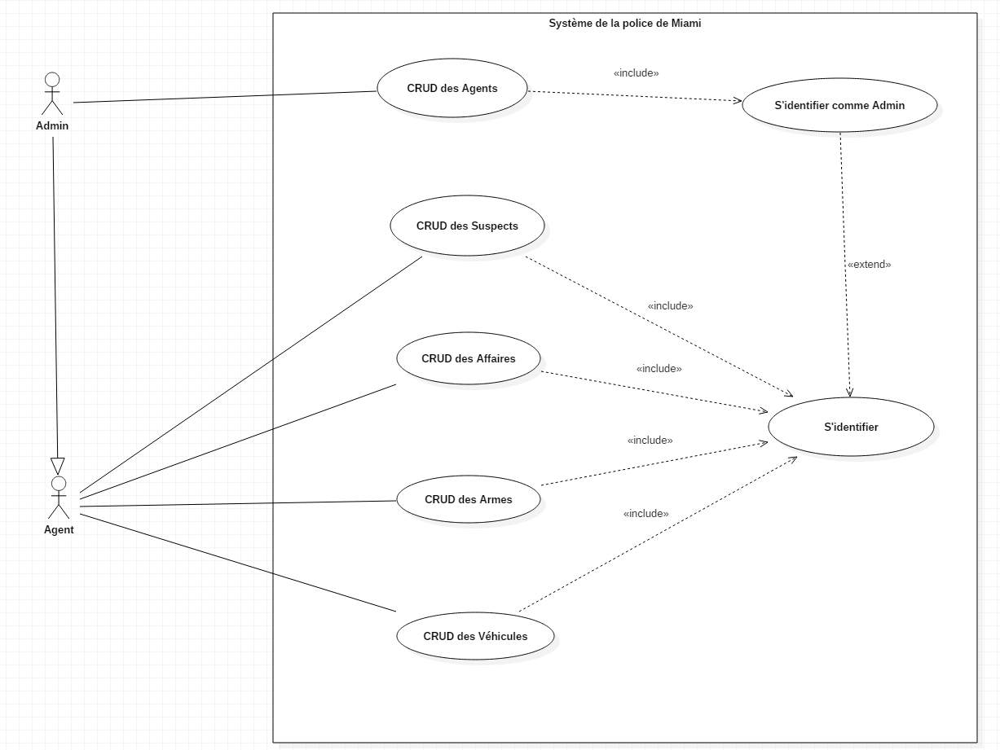

- USECASE DE L’ADMINISTRATEUR

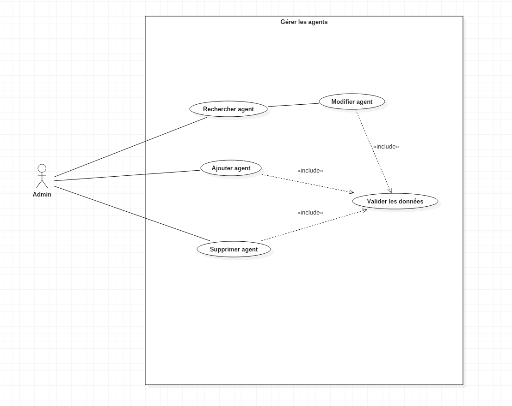


#### /!\ LES CAS D’UTILISATION DETAILLE SONT CONSULTABLES DANS LE DOSSIER DOCUMENT /!\
- documents/Cas_utilisation_detaille_identification.pptx
- documents/UseCaseAffaires.docx
- documents/UseCaseArmes.docx
- documents/UseCaseSuspects.docx
- documents/UseCaseVehicules.docx
- documents/UseCaseAdmin.docx


### DIAGRAMMES D’ACTIVITE

- CONNEXION


- GESTION DES UTILISATEURS

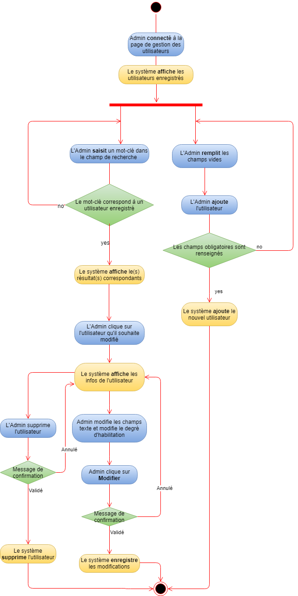

- GESTION DES AFFAIRES

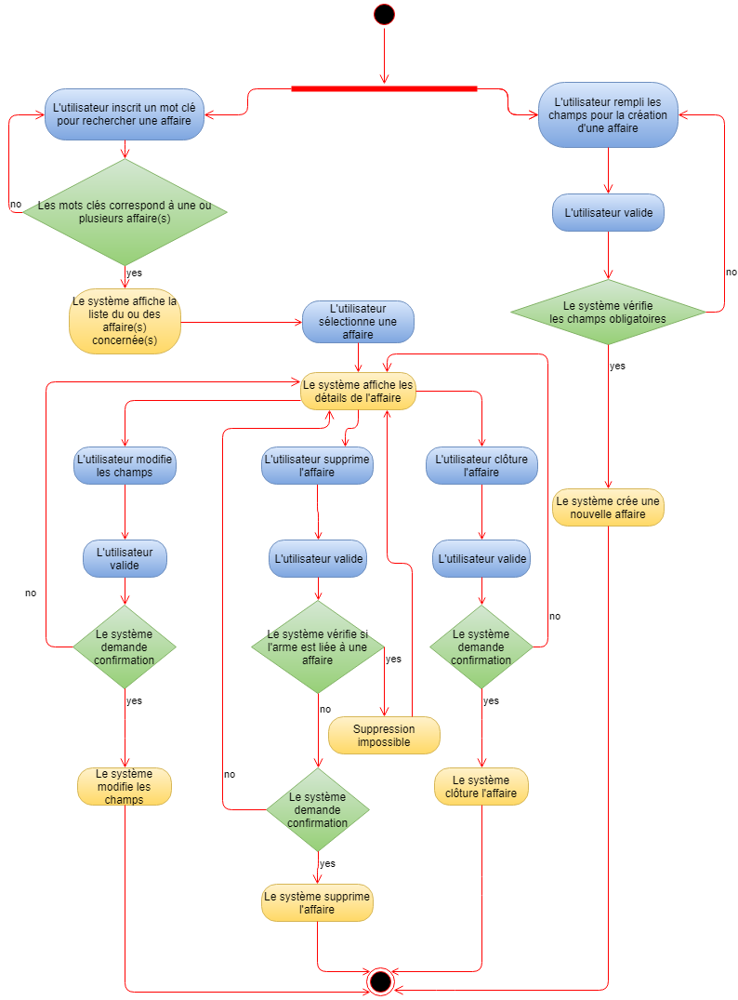

- GESTION DES ARMES

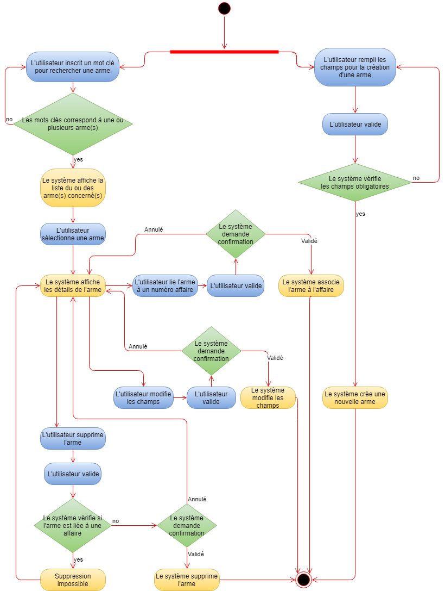

- GESTION DES VEHICULES

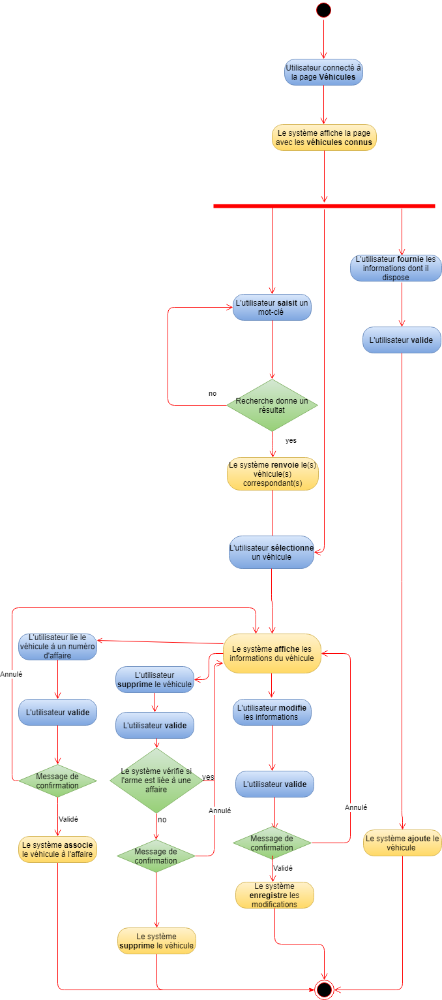


### DIAGRAMME DE CLASSES

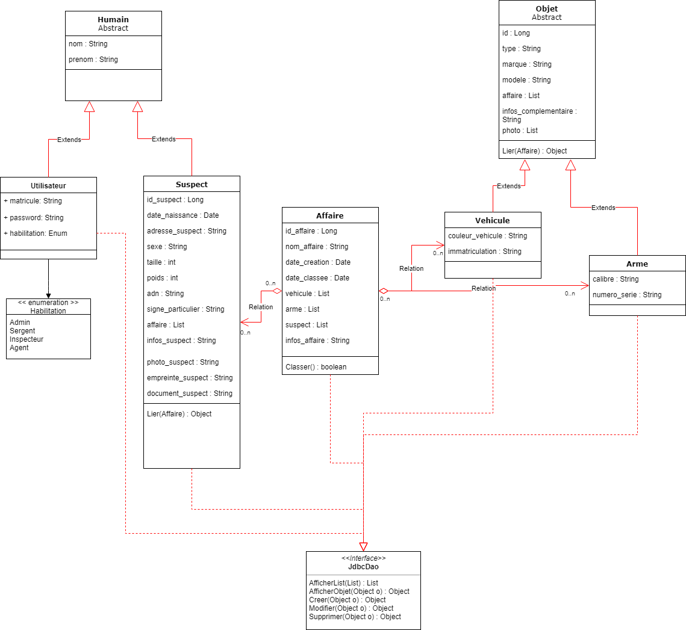

### MOCKUPS

- PAGE D’ACCUEIL

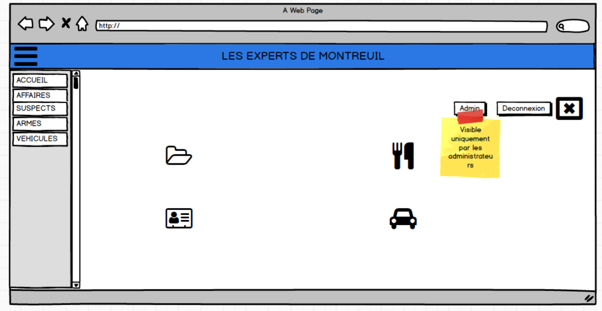

- PAGE DE L’ADMINISTRATEUR

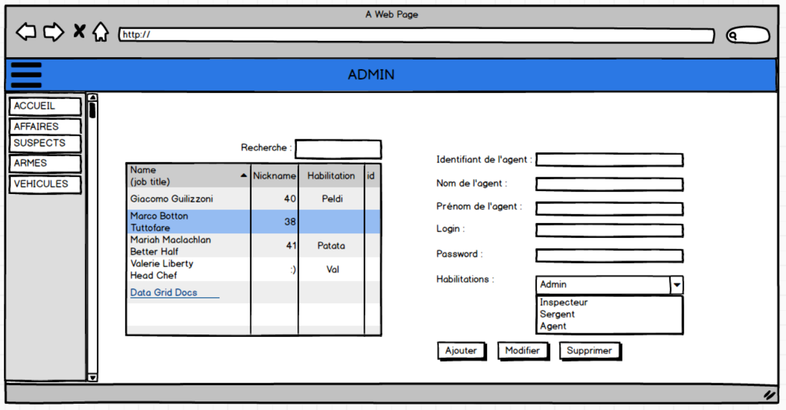

- PAGES DES AFFAIRES

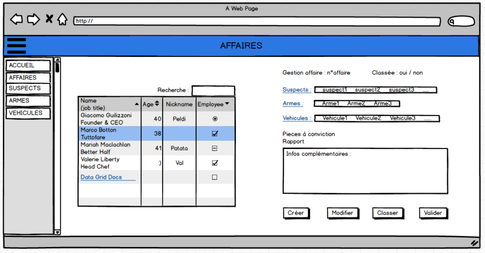

- PAGES DES ARMES

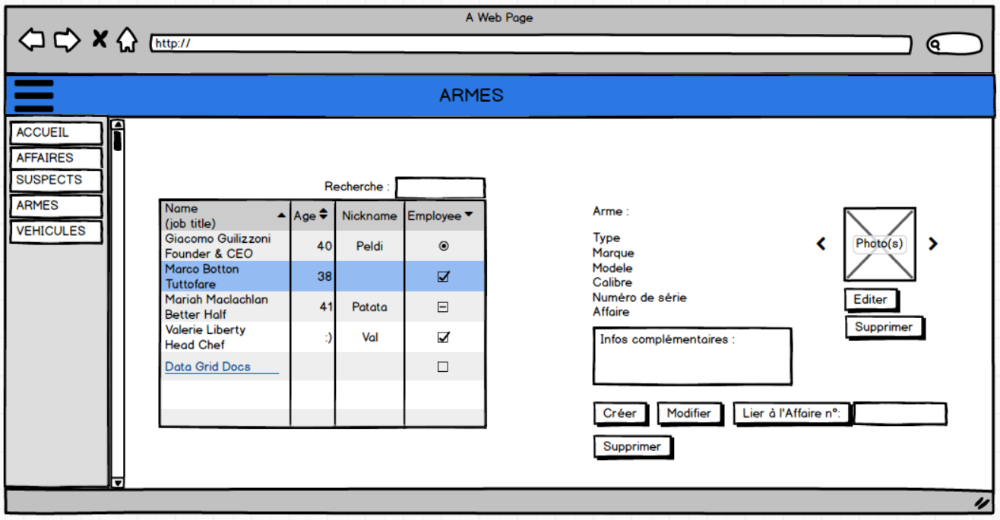

- PAGES DES SUSPECTS

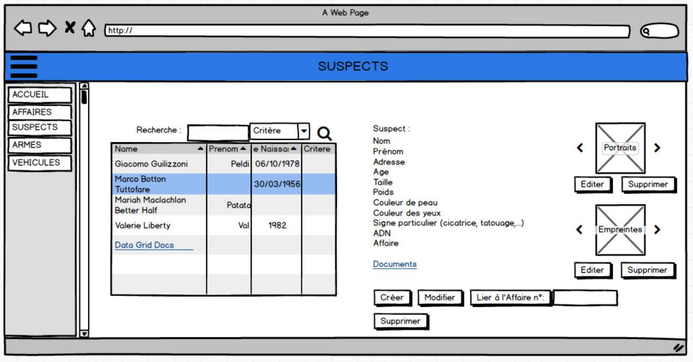

- PAGES DES VEHICULES

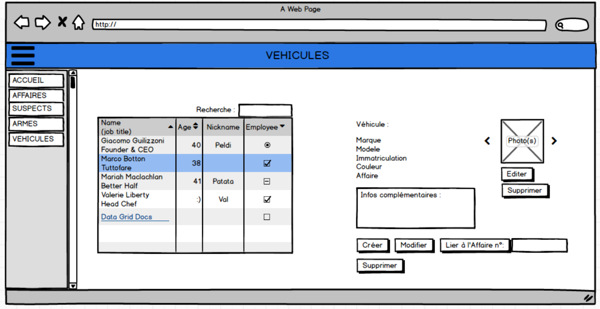

### SCHEMA SQL

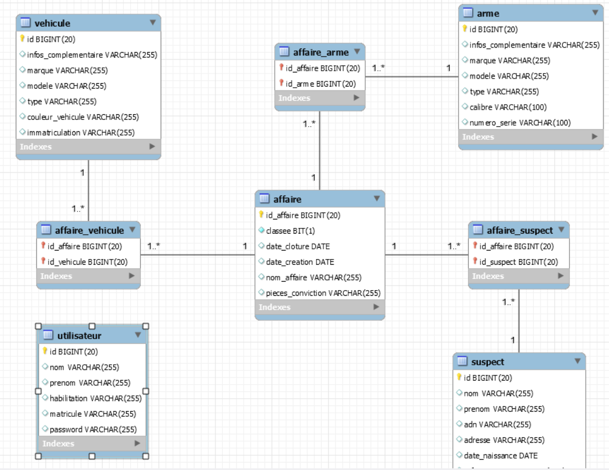


### SCRIPTS SQL

#### /!\ LES SCRIPTS SQL SONT CONSULTABLES DANS LE DOSSIER DOCUMENTS /!\

- documents/Schema.mwb
- documents/filrouge_shema.sql
- Rappel : Pour l’obtention des données, le fichier “data.sql” est nécessaire et bien présent dans le projet (/Fil_Rouge/src/main/resources/data.sql)

## REQUÊTES SQL

- Le framework (Java) utilisé est Hibernate.  
Les requêtes SQL sont alors automatiquement traitées.  
C’est pourquoi, des commentaires ont été intégrés dans les Controllers (/Fil_Rouge/src/main/java/co/simplon/filrouge/controller) afin de visualiser les requêtes SQL correspondantes.


# @Author Davy

## BACK

- DataBase / Requêtes (MySQL Workbench - Travail groupé)
- CRUD Véhicule
- Gestion (création/suppression) liens vehicule/affaire
- Requête affichage des affaires liées à un véhicule
- Gestion de la recherche de la page véhicule
- Tests unitaires

### Fichiers JAVA gérés :
- AffaireController
- Vehicule (model) 
- VehiculeController
- VehiculeDAO
- VehiculeService
- VehiculeRepository
- VehiculeControllerTest


## FRONT

- Page véhicule

### Fichiers ANGULAR gérés :
- vehicule.component (.css/.html/.ts) 
- affaires-liées_au_vehicule.component(.css/.html/.ts)
- ivehicule.ts
- vehicule.service.ts
- api.service.ts
- app.module.ts


## SAUVEGARDE

- GITHUB (sauvegarde/récupération de version de projet et gestion des conflits)
